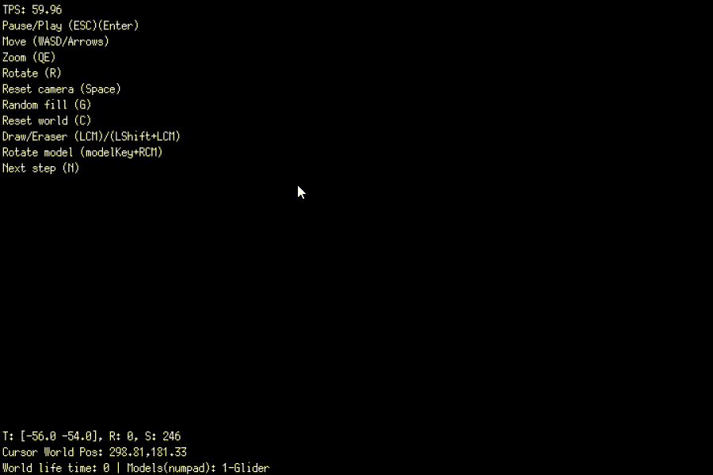
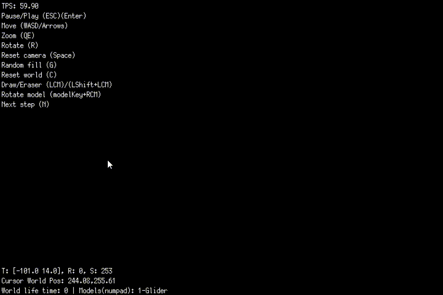

# Conway's Game of Life
From [Wikipedia](https://en.wikipedia.org/wiki/Conway%27s_Game_of_Life), the free encyclopedia:

> The Game of Life, also known simply as Life, is a cellular automaton devised by
> the British mathematician [John Horton Conway](https://en.wikipedia.org/wiki/John_Horton_Conway)
> in [1970](https://en.wikipedia.org/wiki/Conway%27s_Game_of_Life#cite_note-1).
> The game is a [zero-player game](https://en.wikipedia.org/wiki/Zero-player_game),
> meaning that its evolution is determined by its initial state, requiring
> no further input. One interacts with the Game of Life by creating an initial
> configuration and observing how it evolves, or, for advanced players, by
> creating patterns with particular properties

The evolution of the cells follows this four simple rules:
1. Any live cell with fewer than two live neighbors dies, as if by underpopulation.
2. Any live cell with two or three live neighbors lives on to the next generation.
3. Any live cell with more than three live neighbors dies, as if by overpopulation.
4. Any dead cell with exactly three live neighbors becomes a live cell, as if by reproduction.


## About implementation
This is a running implementation of Conway's life game written on go. \
For graphical implementation, the [ebiten](https://github.com/hajimehoshi/ebiten) 2d engine was used.

## Usage

The implementation has the following modes.
1. Random fill mode
2. Drawing mode
3. Mode of ready-made figures

## Random fill mode

In this mode, the first generation of cells is randomly generated.

### Usage:
Random mode can be started by `pressing the key (G)`. \
Then press the key `Enter` to start the game.


## Drawing mode

Drawing mode will allow you to experiment by creating new shapes with the mouse

#### Usage:
Press the key `ESC` for stopping the game. \
Then you can draw the shape with the `LCM(left click mouse)`. \
For the eraser, hold the `Lshift(left shift)` and use the `left mouse button` to delete the cells.



## Mode of ready-made figures

The ready-made shapes' mode allows you to use ready-made shapes from this list. \
The list will be updated.

1. Glider

#### Usage: 
Press the `number` of the shape you want to use. \
The shape will be drawn on the screen. \
And for rotate the shape, press the `RCM(right click mouse)`.



``other tips for managing the game can be found in the upper left corner``

## Install
To quickly start the game, use this command. 
```azure
go run -tags=example github.com/fr13n8/game-of-life@latest
```